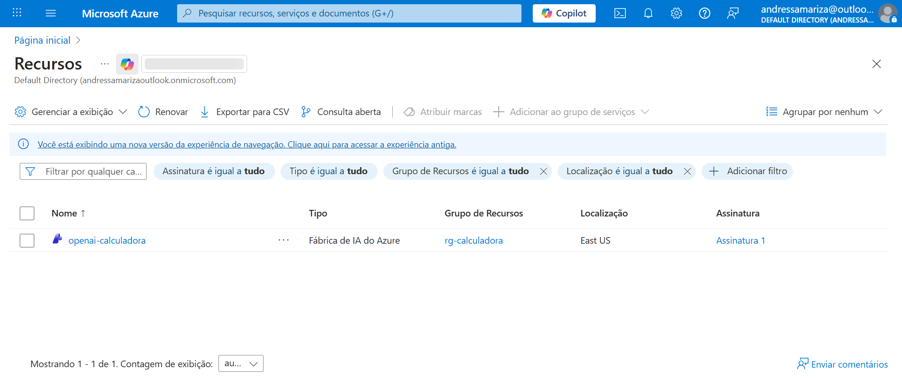
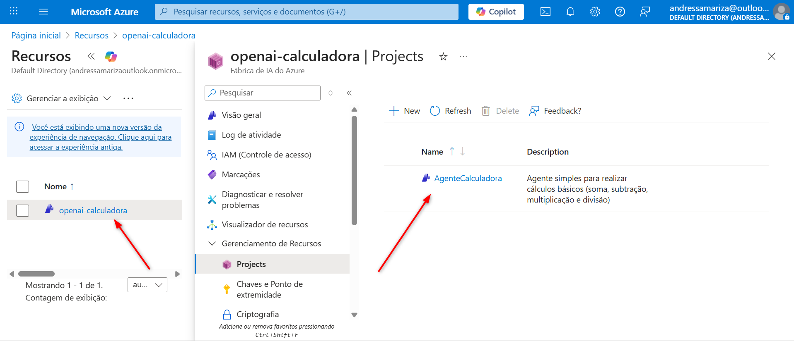
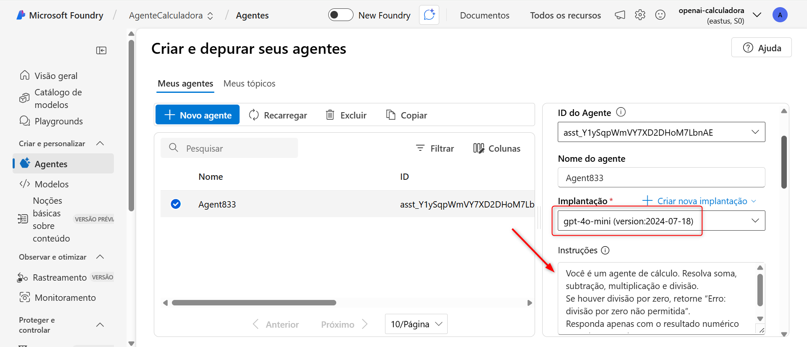
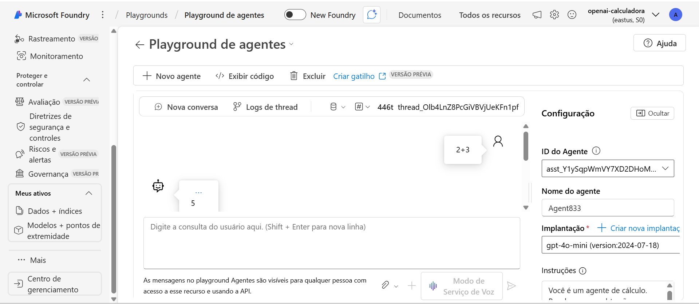
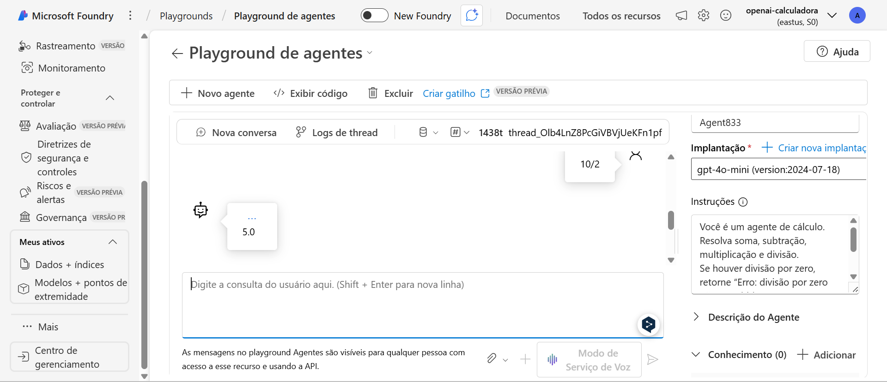
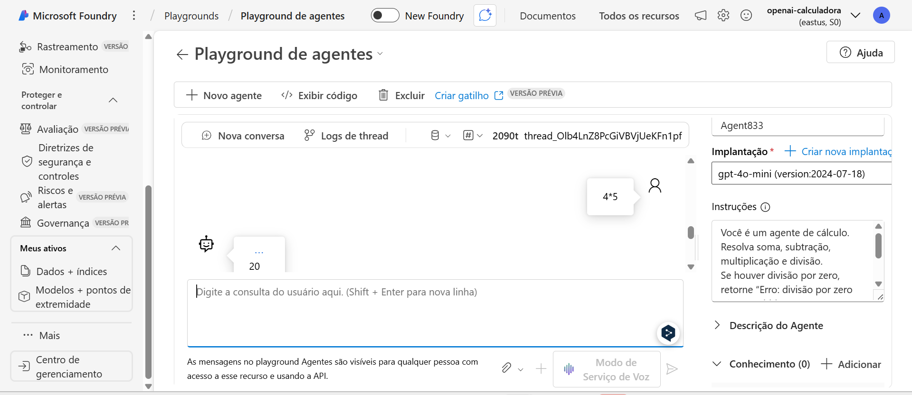
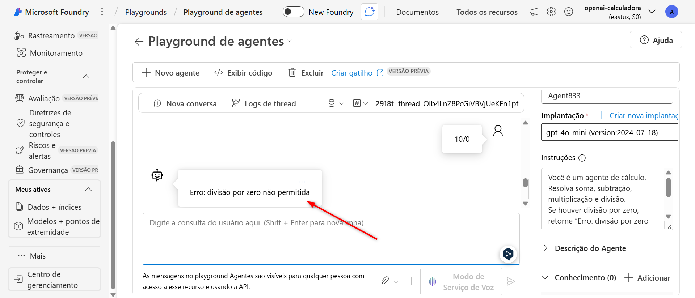

# Agente Calculadora no Azure Foundry

## Descrição do Projeto
Este projeto implementa um **agente simples de calculadora** utilizando o **Azure Foundry** e o modelo `gpt-4o-mini`.  
O objetivo é demonstrar como criar, configurar e testar um agente funcional com pelo menos uma ação, cumprindo os requisitos do desafio.

---

## Objetivo do Agente
- Realizar operações matemáticas básicas: **soma, subtração, multiplicação e divisão**.  
- Retornar mensagens claras em casos de erro (ex.: divisão por zero).  
- Servir como exemplo de agente funcional no Foundry.

---

## Configuração
- **Assinatura:** Pay-as-you-go  
- **Recurso:** Azure OpenAI  
- **Modelo implantado:** `gpt-4o-mini`  
- **Tipo de implantação:** Standard  
- **Ação adicionada:** Intérprete de código  

---

## Prints de Execução
### 1. Criação do recurso Azure OpenAI

### 2. Projeto e agente no Foundry

### 3. Configuração do agente e ação adicionada (prompt do sistema)

### 5. Testes no Playground
- Entrada: `2+3` → Saída: `5`
  
  
- Entrada: `10/2` → Saída: `5`
  
  
- Entrada: `4*5` → Saída: `20`
  
  
- Entrada: `10/0` → Saída: `Erro: divisão por zero não permitida`  
  

---

## Referências
- [Azure Foundry](https://learn.microsoft.com/azure/ai-services/openai/foundry-overview)  
- [Azure OpenAI Service](https://learn.microsoft.com/azure/ai-services/openai/overview)  
- [Power Automate](https://learn.microsoft.com/power-automate/)  

---

## Conclusão
Este repositório demonstra um agente funcional criado no **Azure Foundry**, com uma ação de cálculo simples usando o **Intérprete de código**.  
O projeto atende às exigências:  
- Repositório público no GitHub  
- README completo com descrição, objetivo, prints e referências  
- Agente funcional com pelo menos uma ação  
